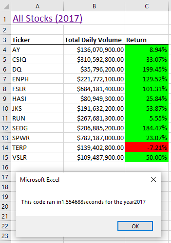
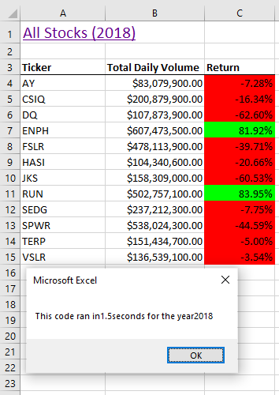

# Stock Analysis with VBA

## Overview of the Analysis
### Purpose
Our client Steve hired us to analyze the performance of green stocks in the stock market during 2017 and 2018. In doing so, Steve hopes to recommend the best stocks to his parents so they can better invest their money.  After the analysis was complete, Steve wanted to run the same analysis for the whole stock market. However, running the analysis of the whole stock market would take too long with the code that we wrote. Therefore, the purpose of this challenge was to refactor the code that had been written, to see if we could optimize the analysis performance and reduce script runtimes. 

## Results
### Original Script Runtimes

#### 2017

Code ran in 1.554688 seconds

#### 2018

Code ran in 1.5 seconds

### Refactoring Code
During the refactoring process we used macros and created a for-loop to iterate over the created ticker index to collect all information at once, instead of running code that ran each row of data indiviually. 

### Refactored Script Runtimes
#### 2017

Code ran in 0.2617188 seconds

#### 2018

Code ran in 0.1640625 seconds

### Runtime Comparison

#### 2017
Originally the script for 2017 ran in 1.555 seconds. After refactoring the script ran for 0.262 seconds, yielding a 59 percent increase in productivity.

#### 2018
Originally the script for 2017 ran in 1.555 seconds. After refactoring the script ran for 0.262 seconds, yielding a 91 percent increase in productivity.

Although runtimes may vary with each execution, we can see that by refactoring our script there is great potential to save a lot of time. The time saved might seem relatively small with the data set that was ran, however the refactored code will save a more significant amount of time and be able to handle the larger data set of the whole stock market that Steve would like to see next.

## Summary
Through this challenge, several advantages and disadvantages were discovered about refactoring code. A disadvantage to refactoring would be trying to decipher the original code and understand what it is doing, especially if you were refactoring code that you did not originally write. Refactoring can be time consuming but is beneficial and will save time in the long run. Once the code is refactored, it can make it easier to read, especially if comments are being added. The biggest advantage of refactoring the code was the decreased processing time. The computer has less work to do to return the same results with the addition of looping.

